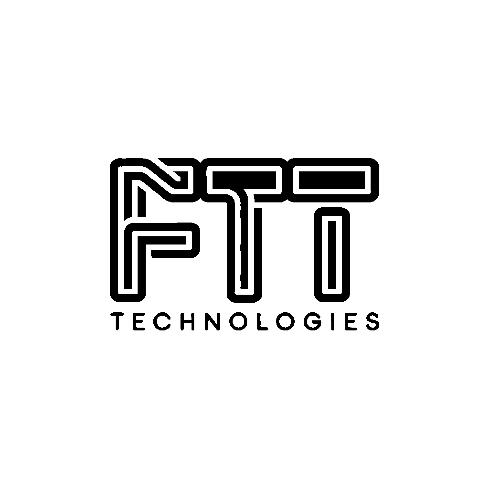

<h1 style="text-align: center;">CHAT IA LOCAL</h1>

<div style="text-align: center;">
  
</div>

Mira el proyecto [aquí](https://www.tu-dominio.com)

## Tecnologías utilizadas

- [Next.js 14](https://nextjs.org/docs/getting-started)
- [NextUI v2](https://nextui.org/)
- [Tailwind CSS](https://tailwindcss.com/)
- [Tailwind Variants](https://tailwind-variants.org)
- [TypeScript](https://www.typescriptlang.org/)
- [Framer Motion](https://www.framer.com/motion/)
- [next-themes](https://github.com/pacocoursey/next-themes)

### Instalar dependencias

Puedes usar uno de estos gestores de paquetes: `npm`, `yarn`, `pnpm`, `bun`. Ejemplo usando `npm`:

```bash
npm install
```

### Ejecutar el servidor de desarrollo

```bash
npm run dev
```

### Configurar pnpm (opcional)

Si estás utilizando pnpm, necesitas agregar el siguiente código a tu archivo .npmrc::

### FTT

<div style="text-align: center;">
  
</div>
